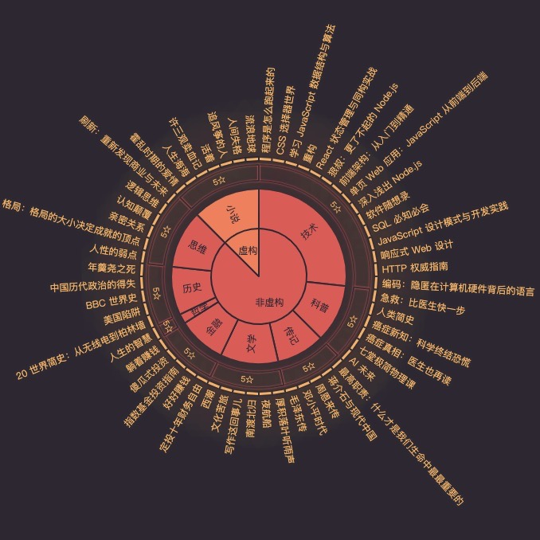

今年是我读书最多的一年，超过了前 23 年读过总和。为什么突然间读了这么多书呢，我想并不是因为顿悟，缘由是去年搬了一次家，搬到了五环边儿上，通勤时间猛增到 3 个小时（早晚各 1 个半小时），地铁上能做什么呢？除了玩手机就是打盹儿，我想还是拿着吃灰好多年的 Kindle 吧，找本书读既能长见识，挤地铁的时间也能过得快一点，对眼睛的伤害还少一点。总的来说，读的书很杂，主要目的是消遣通勤的无聊时光，但我觉得应该为此做一点总结，希望来年无聊之时还会捧起一本书。

## 专业类

职业相关，作为一个程序员，很重要的一个能力就是持续学习、持续接受新思想。虽然我在遇到问题的时候，搜索引擎可以告诉我怎样做，但是书作为一个有整体架构和逻辑的知识载体，它能让我对一个问题产生整体的认知，它不仅可以告诉我怎么做，还会告诉我为什么会出现这种问题，以及会出现新的 API 或新技术来应对这个问题。

1️⃣《重构》⭐️⭐️⭐️⭐️⭐️：这是我今年读的最大部头的专业书籍。第二版用 JavaScript 重构了它自己，我觉得它让我认识到，重构不一定是重构旧代码，这是一种追求更好的思想，如果能嗅到坏代码的味道，那么实现新功能的过程也同样可以重构，重构是一个过程。

2️⃣《程序是怎么跑起来的》&《编码：隐匿在计算机硬件背后的语言》⭐️⭐️⭐️⭐️⭐️：从硬件到软件，从 0 和 1 到高级语言，从二极管到计算机。窥探一下计算机内部原理，就算不懂，也不亏的，就比如我曾经很不理解计算机的浮点数是什么，但读完这两本书之后我对它就有了全新的认知。

3️⃣《学习 JavaScript 数据结构》⭐️⭐️⭐️⭐️：数据结构和算法是程序员的四十米大刀，在于我们怎么用。用自己熟悉的一门语言学习数据结构和算法，门槛会低一点，学到的也能多一点。

4️⃣《HTTP 权威指南》⭐️⭐️⭐️⭐️⭐️：我是略读的，因为主要是为了解决工作中遇到的问题——缓存。这绝对算得了一本工具书，基础中的基础，读一遍有读一遍的收获。

通常书对于当下的技术发展来说时效性比较低，很多技术书刚一出版，这种技术就发布一个大版本。所以对于专业类的书来说，我倾向选择那些比较基础的，理解不变的基础，再去掌握变化的新事物，人们把这种方法叫做『以不变应万变』。

## 小说类

我对小说有一种天然的敬而远之的想法，尤其是外国小说里的人名和啰里啰嗦的对话，那些人名会让我把那些啰里啰嗦的对话搞成一团浆糊，还不得不经常翻回去找人物关系，久而久之，对这种小说的好奇心也都磨灭了。但今年算是有一点改观，因为我从《霍乱时期的爱情》中发现了一种读法，只记外国人名的最短的那部分，比如*阿里萨·弗洛伦蒂诺*，我就可以简单记为*阿里萨*，希望我不是最后一个知道的人。

1️⃣《许三观卖血记》&《活着》⭐️⭐️⭐️⭐️⭐️：这两本书是中国作家余华的作品，余华的笔就是董卿口中的『凌厉的刀锋』，两本书两中人生。我记得读完之后还写了一篇文章：[『书』擦去眼泪，如同掸去身上的稻草](https://coderfee.com/read-think/huozhe-xusanguan)。这两本书也被翻拍成了电影，一部是葛大爷主演的《活着》，《许三观卖血记》则是韩国人翻拍的，氛围轻松、比较逗，可以看一下。

2️⃣《人生海海》⭐️⭐️⭐️⭐️：今年很火的一部虚构类小说，我用微信读书的听书功能听完了这本小说，如果用一句话来说：活在别人故事里的一个人和他的一生。

3️⃣《呼吸》⭐️⭐️⭐️⭐️⭐️：这本书不在上面的那张图片里，因为作图的时候还没有读完。这是一本科幻小说，作者是一位华裔，曾经也是一名程序员。他的文章给了我灵感，让我完成了一篇年终总结（班门弄斧 🤣）。

4️⃣《追风筝的人》⭐️⭐️⭐️⭐️⭐️：如果让你一句话证明看过这本书，那你一定得大声喊出来『为你，千千万万遍』。读完之后很受触动，于是把这本书送给了一位好朋友 🤣。

5️⃣《流浪地球》⭐️⭐️⭐️⭐️：科幻小说，看了贺岁大片《流浪地球》之后一直惦记着看原著，终于在一次出差的途中看完了，一百多页，用手机不到俩小时就看完了。

其实写到这儿我突然想起以前读过的余秋雨的一段话，原话忘记了，大意是生活在别处，把自己抽离出来，放到一个陌生之地，面对另一个世界，造就另一个天地里的自我，这个自我和原来的自我可能产生冲突，很少和解。我想小说就有这样的能力，把自己放到小说里去面对人性善恶，或接受或排斥，体会作者世界里的自我和现实世界自我的碰撞与和解。读一本小说至少可以获得一次精神上的释放。

## 科普类

『雾霾致癌……』、『咖啡致癌……』、『xxx 公司的 AI 研究震惊全球……』，每当我看到这些乌七八糟的内容之后，我就会想『我和死神又一次擦肩而过、我擦这个公司好 🐂🍺』。把这类书单拎出来是因为现在的内容发布者鱼龙混杂，谣言不但不止，甚至越传越严重，所以我觉得这类科普书值得一看，积累一些生活的常识之后，就能自动过滤那些不靠谱的内容，何乐而不为。但我也必须承认，《七堂极简物理课》是完出于好奇才看的，读完之后的我一脸懵逼 🤣。

1️⃣《癌症新知》&《癌症真相》⭐️⭐️⭐️⭐️⭐️：这是一个系列，总共两本书。

2️⃣《AI 未来》⭐️⭐️⭐️：李开复写的。关注点在未来，未来 AI 和人类之间的『博弈』，但着实有点枯燥。

3️⃣《急救：比医生快一步》⭐️⭐️⭐️⭐️⭐️：一位曾经战斗在急救一线的急诊医生写的。

4️⃣《当呼吸化为空气》⭐️⭐️⭐️⭐️⭐️：虽然这是一本患癌医生的自传（在自传完成之前就去世了），但是书中对癌症和医患关系的观点都有值得借鉴的地方。

## 读书这件事儿

读书这件事儿是因人而异的，一千个观众就有一千个哈姆雷特。每个人都有自己的需求，在专业的书籍里寻找工作中问题的答案，在小说里消遣无聊时光，在科普类的书里怀疑一切、打破自己的偏见，在历史传记的书里仰望别人的人生，在哲学的世界里怀疑人生……有些事情并不是想要得到什么，或许只是自己的一种想法激励着我们完成某件事，那就是初心。

---

注 1：开头的图片是用 Echarts 生成的，因为读书的数据在豆瓣都有过标记，先从豆瓣爬取，然后手动改成所需要的数据结构。

注 2：为什么全是 5 星？首先是因为豆瓣的网站上没有我打的评分，其次是我太懒了。
